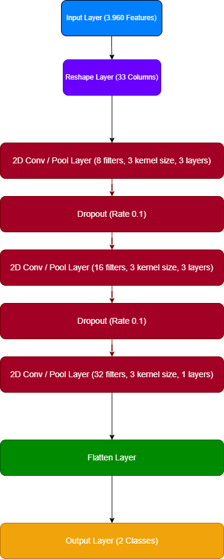

# Edge Music Genre Classifier: Rock vs Classical

Edge Impulse Project Page: https://studio.edgeimpulse.com/public/656112/live

Github Repo: https://github.com/alpd11/Edge_Music_Genre_Classifier

## Introduction

The Edge Music Genre Classifier is an application designed to utilize embedded machine learning to accurately distinguish between Rock and Classical music genres. This project enables the development and deployment of a music genre classification model directly onto embedded devices, providing real-time music genre identification without the need for continuous internet connectivity.

## Objective

The primary aim of this project is to develop a binary classifier that can accurately differentiate between Rock and Classical music using audio inputs. This classifier is intended to enhance user experiences in various applications, such as automated playlist categorization, smart home entertainment systems, and educational tools designed to aid in the learning of musical genres. Also, this project was inspired by a mobile application called “Shazam” which discovers and identifies the song from audio input in real time (Wang, 2003).

## Research Question

**“How effectively can a neural network-based embedded AI system distinguish between Rock and Classical music genres using audio input?”**

## Project Overview

The project development process has four main sections:

1. **Data Collection and Feature Engineering**: An online dataset was found in Kaggle, and it is called “GTZAN Dataset”. Feature Engineering was performed accordingly.  
2. **Model Development**: Model architecture was defined and applied for training purposes.  
3. **Evaluation**: Model was evaluated using a variety of evaluation metrics and tested with a test dataset.  
4. **Deployment**: Model is deployed into Arduino Nano BLE 33 Sense with EON Compiler.  

The application takes the audio input continuously and provides the classification result using the built-in LEDs with the confidence rate printed in Serial Monitor.

- **Red LED**: Rock music  
- **Green LED**: Classical music  
- **Blue LED**: Undecided  

## Data Collection and Feature Engineering

### Data Sources

To ensure a diverse representation of musical characteristics inherent to Rock and Classical genres, audio samples were collected from a Kaggle dataset called “GTZAN Dataset” which was built for music genre classification purposes.

### Data Sets

The dataset comprises 200 audio files, evenly split between the two genres:
•	**Rock**: 100 samples (50%)  
•	**Classical**: 100 samples (50%)  
•	**Total**: 200 samples (100%)  

These samples include a wide range of compositions, capturing the unique elements of each genre to provide a comprehensive training base for the model.

**Table 1.** Train and test split of the dataset.  
| Genre     | Train | Test | Total |
|-----------|-------|------|-------|
| Rock      | 80    | 20   | 100   |
| Classical | 80    | 20   | 100   |
| **Total** | 160   | 40   | 200   |

### Feature Engineering

The audio files were transformed into spectrogram images using Fast Fourier Transform (FFT). These spectrograms serve as the input features for the model, effectively capturing both frequency and time information essential for distinguishing between the musical genres.

The parameters set for the feature generation are given below.

1.	**Frame Length (25 ms)**: Divides audio into 25ms chunks and enough to capture musical detail without losing frequency resolution.  
2.	**Frame Stride (25 ms)**: No overlap between frames and reduces memory usage and speeds up processing, ideal for microcontrollers.  
3.	**FFT Length (64)**: Performs FFT with 64 points and gives approximately 32 frequency bands, small enough to fit in low-memory devices.  
4.	**Noise Floor (-50 dB)**: Filters out very quiet background noise and keeps the spectrogram clean for better genre classification.  

## Model Development

### Model Architecture

A Convolutional Neural Network (CNN) based architecture was chosen for its effectiveness in handling image-like data. Given that our input features are spectrograms, CNNs are ideally suited for this task, recognizing patterns that differentiate genres (Zhang, Wang and Liu, 2019). 2D CNNs were used rather than 1D CNNs because 2D CNNs can capture both time and frequency patterns in spectrograms, whereas 1D CNNs only capture temporal patterns.

**Figure 1.** CNN architecture used for music genre classification.  

### Training Details

•	**Epochs**: 30 to ensure the model had enough opportunity to learn from the data and optimize the training time.  
•	**Validation Split**: 20% of the data was held back from training to validate the model’s accuracy and generalizability.  
•	**Learning Rate**: 0.005 was used to balance convergence speed and stability, allowing the model to learn effectively without overshooting during optimization.  

### Experiments

Initially, before the idea of using a Spectrogram to generate the features, the combination of MFCC (Mel-Frequency Cepstral Coefficients) and MFE (Mel-Filterbank Energy) was the main idea to be used. Besides, Deep neural network (DNN) architecture with several dense layers was considered to train the model with the generated MFCC and MFE features. However, after several trials of feature generation and model training, even though the validation accuracy was over 80%, generated features and the trained model was not optimal for the memory consumption in terms of RAM (over 100 kB) and Flash (over 300 kB).

After careful consideration of feature generation and model architecture, the features were generated using Spectrogram. On the other hand, after feature generation method was finalized, the model architecture had a comparison between 1D CNN and 2D CNN. Several trials of model training and adjustments on layers were made, however, 1D CNN didn’t satisfy the conditions for a high validation accuracy (below 60%).

## Evaluation

The model was evaluated with a variety of evaluation metrics used in machine learning. The model achieved a high accuracy and performance in both unoptimized (float32) and quantized (int8) versions.

•	**Validation Accuracy**: The model achieved 97.2% accuracy on the validation set.  
•	**Test Accuracy**: The model maintained a high 93.36% accuracy on unseen test data, demonstrating strong generalization performance.  
•	**Loss**: The model recorded a low loss of 0.08, indicating a good fit to the data without significant overfitting.  

**Table 2.** Evaluation metrics for validation and test datasets across model types.  
| Set        | Model   | Accuracy | Precision | Recall | F1-score | ROC AUC | Loss   |
|------------|---------|----------|-----------|--------|----------|---------|--------|
| Validation | int8    | 0.9722   | 0.9726    | 0.9722 | 0.9722   | 0.9722  | 0.0802 |
| Validation | float32 | 0.9733   | 0.9735    | 0.9733 | 0.9733   | 0.9733  | 0.0779 |
| Test       | int8    | 0.9391   | 0.9429    | 0.9391 | 0.9389   | 0.9390  | 0.1631 |
| Test       | float32 | 0.9395   | 0.9431    | 0.9395 | 0.9394   | 0.9395  | 0.1581 |

**Table 3.** Confusion matrix showing classification performance.  
|               | Classical (Predicted) | Rock (Predicted) |
|---------------|-----------------------|------------------|
| Classical     | 95.7%                 | 4.3%             |
| Rock          | 1.3%                  | 98.7%            |

**F1 Scores**:
- Classical: 0.97  
- Rock: 0.97  

## Deployment

The trained model was converted into EON Compiler format to ensure compatibility with embedded devices and have a better optimized RAM, ROM, and Flash with maintaining the same accuracy. It was then deployed on an Arduino Nano 33 BLE Sense with the quantized version, which uses its onboard microphone to capture ambient audio for real-time classification.

**Table 4.** Comparison between quantized and unoptimized model on hardware performance.  
| Metric       | Quantized (int8) | Unoptimized (float32) |
|--------------|------------------|------------------------|
| Latency      | 205 ms           | 3,139 ms               |
| RAM          | 45.6K            | 158.6K                 |
| Flash        | 44.5K            | 69.3K                  |
| Accuracy     | 93.36%           | 93.59%                 |

## Observations and Reflection

### Observations

The classifier demonstrated strong performance with an overall accuracy of 93.5%, and F1 scores of 0.97 for both Rock and Classical music. The confusion matrix revealed minimal misclassification, with only 4.3% of classical music misclassified as rock, and 1.3% of rock misclassified as classical, indicating a well-balanced model that avoids genre bias.

During experimentation, the model architecture played a critical role. The use of spectrograms as input features provided a meaningful time-frequency representation of music, enabling the convolutional neural network (CNN) to identify distinguishing patterns such as instrument type, rhythm complexity, and harmonic textures that differ between the two genres.

Quantized model (int8) significantly improved efficiency. The latency dropped from 3139 ms to just 205 ms, and RAM usage decreased from 158.6K to 45.6K, with only a slight trade-off in accuracy (from 93.59% to 93.36%). This validated the viability of edge deployment without substantial loss in model performance.

The classifier was particularly sensitive to certain high-frequency percussive elements and distorted guitar sounds in Rock, and string instrument patterns in Classical. This sensitivity helped the model generalize well across subgenres and varying audio quality levels.

The use of a CNN over a simpler fully connected DNN was critical in achieving high accuracy, especially when working with spectrogram data. Convolutional layers helped extract spatial features that aligned with the time-frequency characteristics of music.

No overfitting was observed, despite the relatively small dataset. This is likely due to the clear differences in the genre features and careful model tuning.

### Reflection

The Edge Music Genre Classifier meets its core goal which was to reliably distinguish between Rock and Classical music using only an onboard microphone and an energy-efficient microcontroller.

Key learnings emerged from the experimentation process. Model architecture decisions were more influential on performance than the number of epochs or data augmentation strategies.

This project could be expanded in several directions:

•	Incorporating additional genres to build a multi-class classifier (e.g., Jazz, Pop, Hip-Hop)  
•	Building an interactive UI or mobile companion app to visualize the genre detection in real-time  

---

**Total word count: 1,350 words**

## Bibliography

Edge Impulse, n.d. *Deploying machine learning models to embedded devices*. [online] Available at: <https://docs.edgeimpulse.com/docs/edge-impulse-studio/cli-tools/ei-model-deployment>.

Hershey, S., Chaudhuri, S., Ellis, D.P.W., Gemmeke, J.F., Jansen, A., Moore, R.C., Plakal, M., Platt, D., Saurous, R.A., Seybold, B., Slaney, M., Weiss, R.J. and Wilson, K., 2017. CNN architectures for large-scale audio classification. *In: 2017 IEEE International Conference on Acoustics, Speech and Signal Processing (ICASSP)*. New Orleans, LA: IEEE, pp.131–135. doi:10.1109/ICASSP.2017.7952132.

Olteanu, A., 2021. *GTZAN Dataset - Music Genre Classification*. [online] Kaggle. Available at: <https://www.kaggle.com/datasets/andradaolteanu/gtzan-dataset-music-genre-classification>.

Wang, A., 2003. An industrial strength audio search algorithm. *In: Proceedings of the 4th International Conference on Music Information Retrieval (ISMIR)*. Baltimore, USA. Available at: <https://www.ee.columbia.edu/~dpwe/papers/Wang03-shazam.pdf>.

Zhang, X., Wang, J. and Liu, Y., 2019. A music genre classification method based on audio spectrogram and CNN. *IEEE Access*, 7, pp.149190–149198. doi:10.1109/ACCESS.2019.2947104.
